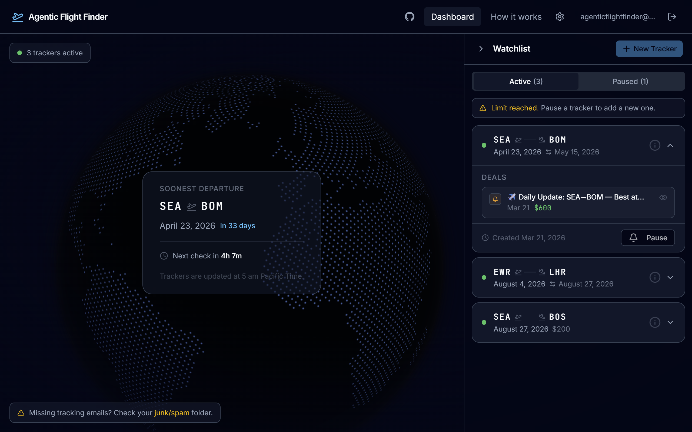
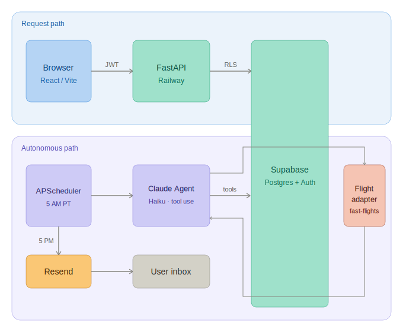
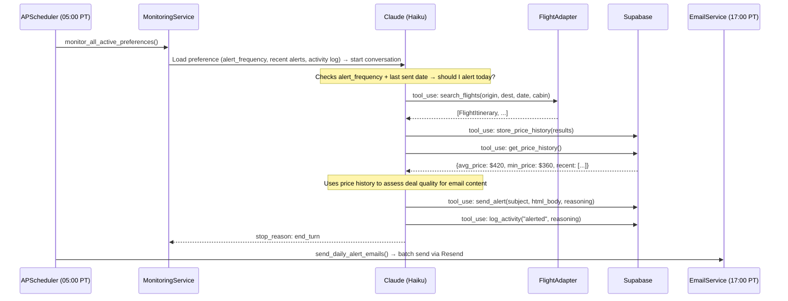
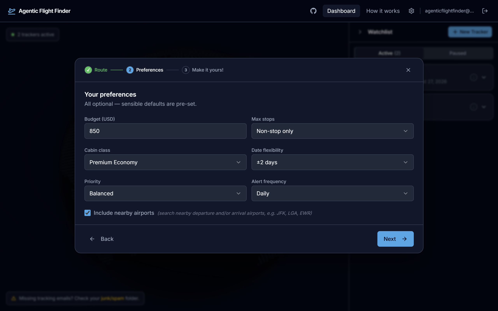
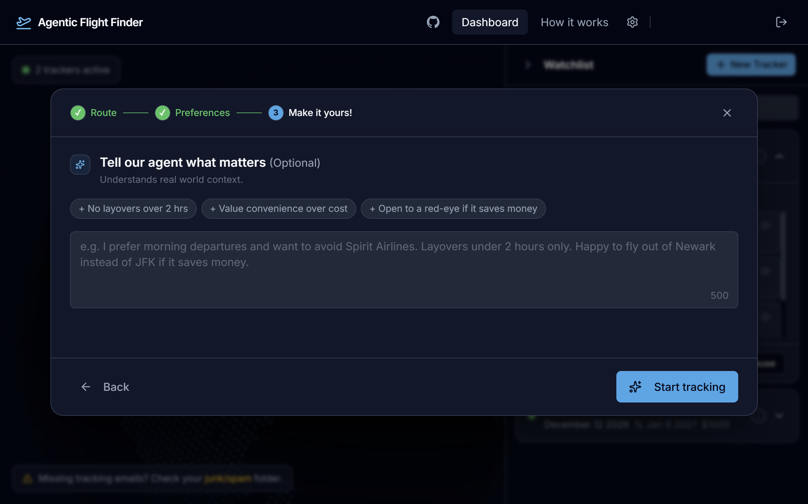
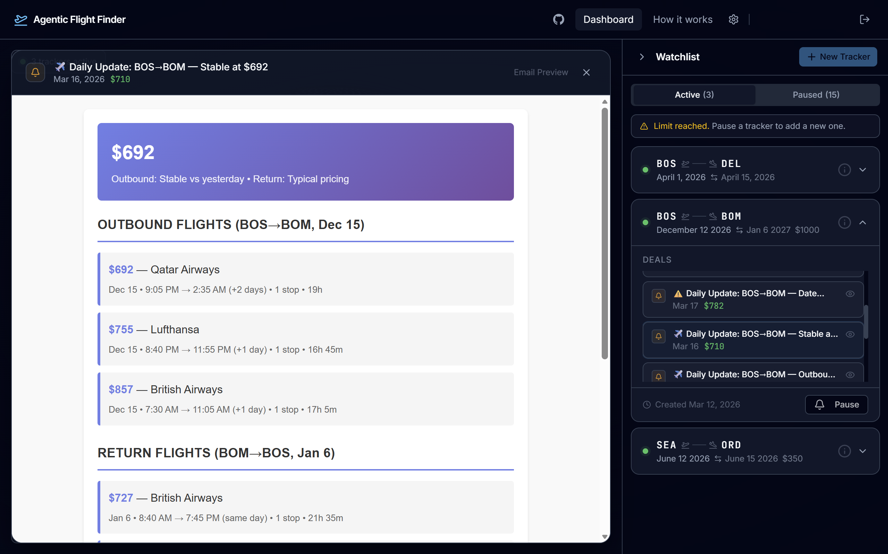

# Agentic Flight Finder

Agentic Flight Finder is a web app for setting up autonomous flight monitors. Pick a route and preferences once, and a Claude agent runs each morning to reason through your case — deciding whether to search, how to evaluate results against its own price history, and whether an alert is due. The longer it runs, the sharper its assessments get.

**Live:** [flightfinders.org](https://flightfinders.org)

     



---

## How It Works

You set a flight route, budget, and preferred cabin class through a multi-step wizard. From there, a scheduled Claude agent takes over each morning. Claude goes through each preference and makes tool calls based on context (e.g. how long since last alert, price history). When you receive an alert, it includes a formatted summary with current prices and Claude's evaluation of them (good, typical, or above average).

---

## System Architecture



The system has two distinct execution paths. The **request path** handles user interactions synchronously: the React frontend talks to a FastAPI backend on Railway, which reads and writes to Supabase with Row Level Security enforced via the user's JWT. The **autonomous path** runs independently of any user request: APScheduler triggers monitoring at a fixed time, the Claude agent runs its tool loop, and results are batched for email delivery later in the day. These paths share Supabase as a data store but use different Supabase client configurations (see [Backend Architecture](#backend-architecture)).

---

## The Agent

A Claude agent runs on a cron schedule, using multi-turn tool use to reason through each user's preference (see https://platform.claude.com/docs/en/agent-sdk/agent-loop for more details). Based on context like alert frequency and recent activity, it decides whether to search for flights, update price history, send an alert, or skip the run entirely.

### Tools

| Tool | What it does |
|---|---|
| `search_flights` | Queries the active flight adapter for a given route, date, cabin class, and stop limit. Returns a list of `FlightItinerary` objects. |
| `store_price_history` | Persists search results to `price_history`. Each call creates a timestamped snapshot tied to the user's preference. |
| `get_price_history` | Returns aggregate stats (`avg_price`, `min_price`, `max_price`) and the five most recent search sessions for the agent to reason against. |
| `send_alert` | Saves a formatted HTML alert to `alerts_sent`. On a preference's first-ever alert, sends immediately; subsequent alerts batch for the daily delivery run. |
| `log_activity` | Records the agent's decision for each run: `searched`, `alerted`, `skipped_search`, or `no_results_found`. Creates an audit trail. |

### Monitoring Lifecycle



### The Agentic Loop

```python
# backend/claude_service.py
while conversation_turns < MAX_TURNS:
    response = client.messages.create(model=MODEL, tools=TOOLS, messages=messages)

    if response.stop_reason == "end_turn":
        return {"response": final_text, "tools_used": tools_used, "turns": conversation_turns}

    if response.stop_reason == "tool_use":
        tool_results = execute_tools(response.content, user_id, preference_id)
        messages += [{"role": "assistant", ...}, {"role": "user", "content": tool_results}]
        continue
```

One design decision worth noting: `user_id` and `preference_id` are overridden server-side in every tool result, regardless of what the agent passes. This prevents a crafted system prompt or unexpected agent behavior from redirecting tool calls to another user's data.

---

## Backend Architecture

### Adapter Pattern: Flight Sources

I applied the adapter pattern to flight data because I wanted my flight data layer to be independent of any specific provider. Flight data sources change: APIs get deprecated, pricing models shift, and better options emerge. The provider I use today might not be the best provider down the line, and I wanted to build for changeability.

To make this swappable without touching the agent or database layer, I built `FlightAdapter` as an abstract base class:

```python
# backend/adapters/flights/adapter_interface.py
class FlightAdapter(ABC):
    def search_flights(self, origin, destination, departure_date, ...) -> List[FlightItinerary]:
        self._validate_inputs(origin, destination, departure_date)
        return self._search_flights_impl(origin, destination, departure_date, ...)

    @abstractmethod
    def _search_flights_impl(...) -> List[FlightItinerary]:
        ...
```

Both `FastFlightsAdapter` and `FlightAPIAdapter` implement `_search_flights_impl()` and normalize responses to the same `UniversalFlight` / `FlightItinerary` dataclasses. The Claude agent only ever sees those normalized types. Migrating to another service means writing a new concrete adapter; nothing else changes.

### Adapter Pattern: Email Providers

The same pattern governs email. `EmailAdapter` defines `send_email()` and a default `send_batch()` that loops over individual sends. `ResendEmailAdapter` overrides `send_batch()` with Resend's native batch API, chunking up to 100 emails per request. A factory reads `EMAIL_PROVIDER` from the environment, returns the right adapter, and caches it for the process lifetime:

```python
# backend/adapters/email/factory.py
@lru_cache(maxsize=1)
def get_email_adapter() -> EmailAdapter:
    provider = os.getenv("EMAIL_PROVIDER", "resend").strip().lower()
    if provider == "smtp":
        return SMTPEmailAdapter()
    if provider == "resend":
        return ResendEmailAdapter()
    raise ValueError(f"Unknown EMAIL_PROVIDER: {provider}")
```

Switching from Resend to SMTP (or any future provider) requires changing one environment variable.

### Service Layer

HTTP handling and business logic are strictly separated. Routes call services; services call adapters and the database; nothing bleeds across layers.

- **`PreferenceService`**: Preference CRUD with business rule enforcement (e.g., active preference limits, reactivation validation). Accepts a `supabase_factory` callable in its constructor so the correct client (user-scoped vs. service-role) flows through without global state.
- **`MonitoringService`**: Orchestrates Claude agent execution. Exposes `trigger_immediate_monitoring()` for use from routes (as a background task on first preference creation) and `monitor_all_active_preferences()` for the scheduler.

### Dual Supabase Client Strategy

The backend uses two Supabase clients with different privilege levels. The **service-role client** (`get_supabase()`) bypasses Row Level Security and is used exclusively by the scheduler, which has no user JWT to work with (kind of like an admin-key). The **user-scoped client** (`get_user_supabase(jwt)`) is initialized with the user's token, which Supabase uses to enforce RLS at the database layer on every query. Request handlers always receive a user-scoped client; the scheduler always uses the service-role client. This separation means application-layer bugs in the request path cannot read another user's data.

---

## Screenshots

**Tracker setup: preferences step.** Optional details for a flight preference so Claude can intelligently filter routes. Includes options like 'Include nearby airports' (ex. JFK, LGA, and EWR are all in New York, taking off from either is fine).



**Tracker setup: additional context step.** Users can specify airline preferences, layover limits, departure time windows, or anything else that matters to them.



**Email preview.** Each alert is viewable in-app and sent to the user's inbox.



---

## Tech Stack

| Layer | Technology |
|---|---|
| **Backend** | Python 3.12, FastAPI, Uvicorn |
| **AI** | Anthropic Claude Haiku (`claude-haiku-4-5`) |
| **Scheduling** | APScheduler (cron, Pacific Time) |
| **Database / Auth** | Supabase (Postgres + Row Level Security) |
| **Flight Data** | fast-flights / flightapi.io |
| **Email** | Resend (transactional API) / SMTP fallback |
| **Frontend** | React 19, TypeScript, Vite |
| **UI Components** | shadcn/ui (Radix + Tailwind CSS) |
| **Deployment** | Railway (backend + frontend split) |

---

## Local Development

```bash
# Backend
cp .env.example .env          # Fill in keys you need
pip install -r requirements.txt
uvicorn backend.main:app --reload

# Frontend
cd frontend
npm install
npm run dev
```

Required environment variables are documented in [`.env.example`](.env.example).

---

## About

Most flight tracking tools don't support passive monitoring, and when they do, they can't account for real user context. I wanted something to passively monitor routes I was eyeing, while accounting for the kind of specific context a traditional booking service ignores.
